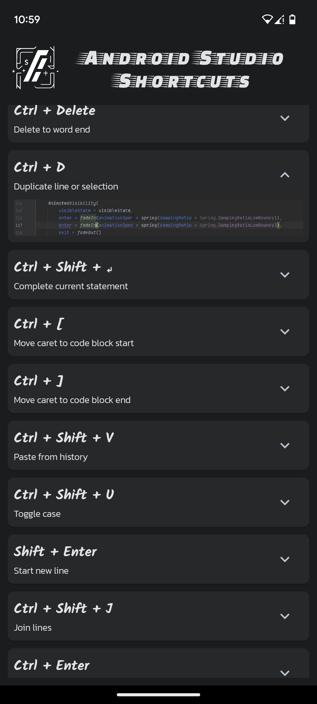

# Android Studio Shortcuts

Android Studio Shortcuts is an Android app designed to help developers learn and master the keyboard shortcuts in Android Studio, enabling faster and more efficient coding. The app showcases a lazy list view implemented using Jetpack Compose. Each element in the list is a card that displays a shortcut and provides a dropdown button. Clicking the button reveals a GIF demonstrating the shortcut's functionality. All shortcut GIFs are captured using Gyazo. The logo was created using Midjourney. All resources and design elements used in the app are generated by the author.

## Features

- Browse a collection of essential keyboard shortcuts in Android Studio.
- View animated GIFs demonstrating each shortcut's usage.
- Search for specific shortcuts or browse through the complete list.
- Expand or collapse individual shortcut cards for a cleaner browsing experience.
- Learn and practice Android Studio shortcuts for faster coding workflows.

## Dependencies

- Jetpack Compose: The modern UI toolkit for building native Android apps.
- Gyazo: Used for capturing and sharing animated GIFs of the shortcuts.
- Midjourney: Used to generate unique and captivating artwork, including the app's logo.

## Screenshots

  

  

